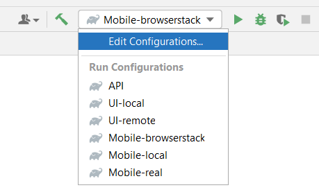

# Проект по автоматизации тестирования интернет-магазина «Читай-город»


> «Читай-город» – это самая большая в России сеть книжных магазинов и интернет-магазин.

## :bookmark_tabs: Содержание
* <a href="#description">Описание</a>
* <a href="#stack">Cтек технологий</a>
* <a href="#object">Реализованные проверки</a>
* <a href="#launch">Запуск проекта</a>
   + <a href="#gradle-command">Gradle</a>
   + <a href="#idea-config">Запуск конфигурации в IDEA</a>
* <a>Скриншоты и видео</a>
  + <a href="#selenoid">Selenoid</a>
  + <a href="#jenkins">Jenkins</a>
  + <a href="#allure">Allure</a>
  + <a href="#telegram">Telegram</a>
  
## <a name="description">Описание</a>
Проект содержит в себе тесты на UI, API и Mobile (Android)\
Список того, что было реализовано в проекте:
- [x] Реализация `Page Object` с использованием `Chain of Invocations`
- [x] Параметризованные тесты
- [x] Параллельное выполнение тестов с помощью `JUnit 5`
- [x] Генерация рандомных значений с помощью библиотеки `Faker`
- [x] Параметризованные билды `Jenkins`
- [x] Конфигурационные файлы для запуска билдов с различными параметрами
- [x] Конфиги с помощью библиотеки `Owner`
- [x] Использование `POJO` для моделей для API тестов
- [x] Objects serialization/deserialization for API requests/responses using `Jackson`
- [x] Использование Request/Response спецификаций для API тестов
- [x] Кастомный Allure listener для форматированного логирования API запросов/ответов
- [x] Интеграция с `Allure TestOps`
- [x] Autotests as test documentation
- [x] Интеграция с `Jira`


<a id="stack"></a>
## :hammer_and_wrench: Cтек технологий
<div align="center">
<a href="https://www.jetbrains.com/idea/"></a>
<a href="https://www.java.com/"></a>
<a href="https://junit.org/junit5/"></a>
<a href="https://selenide.org/"></a>
<a href="https://rest-assured.io/"></a>
<a href="https://gradle.org/"></a>
<a href="https://github.com/allure-framework/"></a>
<a href="https://www.jenkins.io/"></a>
<a href="https://aerokube.com/selenoid/"></a>
<a href="https://github.com/"></a>
<a href="https://telegram.org/"></a>
<a href="https://qameta.io/"></a>
<a href="https://appium.io/"></a>
<a href="https://www.browserstack.com/"></a>
</div>

<a id="object"></a>
## :mag: Реализованные проверки

<a id="launch"></a>
# :computer: Запуск проекта
  
<a id="gradle-command"></a>
## Gradle
Для запуска тестов с помощью Gradle используется команда:
```bash
gradle clean <tag> -Dplatform=<platform> -Denv=<env>
```
`tag` - выбор вида тестов:
>- *api*
>- *ui*
>- *mobile*
  
`platform` - платформа:
>- *\<не задаётся\> (для API тестов)*
>- *ui*
>- *mobile*
  
`env` - окружение, на котором будут выполнятся тесты:
>- *\<не задаётся\> (для API тестов)*
>- *remote (для UI)*
>- *real (для Mobile)*
>- *browserstack (для Mobile)*
>- *local (для UI и Mobile тестов)*

В зависимости от выбранной платформы и окружения, будет использоваться определенный property file

<a id="idea-config"></a>  
## Запуск конфигурации в IDEA
Для удобства запуска тестов конфигурационные файлы IDEA добавлены в репозиторий
<p  align="center">

</p>

<a id="selenoid"></a>
## <a href="https://selenoid.autotests.cloud/video/4a544544d069a501ee461083c9babb79.mp4">Selenoid</a>

<video src="https://user-images.githubusercontent.com/110110734/193814550-cef6ecdb-f702-4fa5-a6cf-4cf6cc523097.mp4"
controls="controls" style="max-width: 730px;" poster="/external/logos/Selenoid.svg">
Видео не доступно для этого браузера
</video>

<a id="jenkins"></a>
##  <a href="https://jenkins.autotests.cloud/job/Nurekenov-homework16/">Jenkins</a>
  
<a href="https://jenkins.autotests.cloud/job/Nurekenov-homework16/">


</a>

<a id="allure"></a>
## <a href="https://jenkins.autotests.cloud/job/Nurekenov-homework16/allure//">Allure</a>

<table>
    <tr>
        <td>
        <a href="https://jenkins.autotests.cloud/job/Nurekenov-homework16/allure/">
        
        </a>
        </td>
        <td>
        <a href="https://jenkins.autotests.cloud/job/Nurekenov-homework16/allure/#suites/ef54aae4465c6d48b51f0d82b2bbde21/238f0e3250120aee/">
        
        </a>
        </td>
    </tr>
        <tr>
        <td>
        <a href="https://jenkins.autotests.cloud/job/Nurekenov-homework16/allure/#suites/ef54aae4465c6d48b51f0d82b2bbde21/238f0e3250120aee/">
        
        </a>
        </td>
        <td>
        <a href="https://jenkins.autotests.cloud/job/Nurekenov-homework16/allure/#suites/ef54aae4465c6d48b51f0d82b2bbde21/e86211dfbb768d26/">
        
        </a>
        </td>
    </tr>
</table>

<a id="telegram"></a>
## <a href="https://t.me/MarketKzNotificationBot">Telegram</a>


